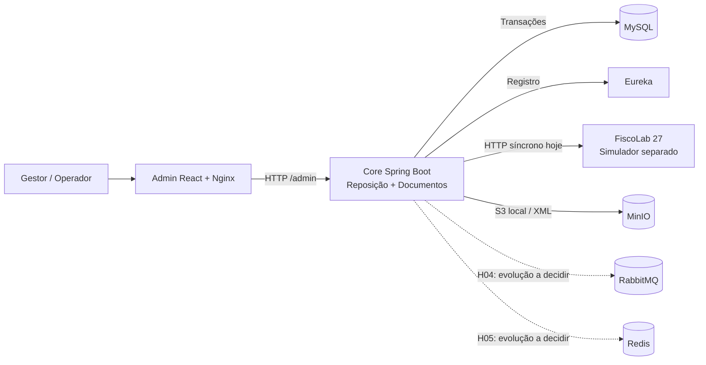

# Rota Clara — evolução de um sistema em funcionamento

A **Rede Brisa 27** é uma empresa fictícia com o **Centro Horizonte**, a **Loja Aurora** e a **Loja Lagoa**. Sua equipe usa o **Rota Clara** para solicitar reposições, confirmar recebimentos e consultar documentos de transferência. O sistema já existe: você recebe código, dados sintéticos, interface e serviços locais funcionando. Seu trabalho começa investigando e evoluindo essa base.

O desafio reúne **três correções e duas melhorias**. Queremos avaliar como você encontra causas, preserva regras de negócio, decide fronteiras técnicas, testa mudanças e explica sua solução. A criação do setup inicial não faz parte da avaliação. Todos os nomes, dados e documentos são fictícios.

## Prazo, autonomia e uso de IA

Você tem **cinco dias úteis**, contados após o recebimento do kit completo. Um envio na quarta-feira termina na quarta-feira seguinte, no mesmo horário, salvo feriados do calendário combinado. A organização informa data, hora e calendário; o fuso é America/Fortaleza. O prazo não exige dedicação integral de quarenta horas.

Você pode usar IA para investigar, escrever código e documentação. Registre o uso de forma breve e explique o que revisou e como verificou. Avaliaremos o domínio da solução apresentada, inclusive em perguntas sobre falhas e mudanças de cenário.

A entrega desta versão é em **código-fonte**, com incrementos executáveis, testes e artefatos das cinco histórias. Propostas técnicas complementam as decisões, mas não substituem a implementação. Diferencie resultados executados de possibilidades ainda propostas; não há bônus por volume de código.

Pode reorganizar módulos, criar um serviço, propor mais de um repositório ou manter tudo junto. Justifique o benefício e o custo. Preserve o fluxo do usuário e os contratos existentes, ou apresente um plano explícito de compatibilidade. Não é necessário reescrever o sistema, criar um ERP, integrar serviços reais ou desenvolver autenticação de produção.

## H00 — base entregue pela organização

**Pronta, sem pontuação e sem atividade de construção para o candidato.** A base executa um fluxo feliz de solicitação, recebimento e documento simulado. Ela contém deliberadamente os sintomas das H01–H03 e as limitações que motivam H04–H05. “Funcionando” significa que o fluxo principal roda; não significa que os chamados já estejam resolvidos.

### Subir o ambiente

Pré-requisitos: Docker Engine com Docker Compose v2 ou superior; internet para baixar imagens e dependências na primeira execução. Reserve inicialmente 8 GB de memória para o Docker e espaço livre para os builds. Não é necessário instalar Java, Maven, Node ou Go na máquina. Os verificadores opcionais usam Python 3, ou podem ser executados pelo container fiscal conforme abaixo.

```sh
# Execute os comandos na pasta rota-clara-lab.
docker compose up --build -d
# Verificação de prontidão, sem instalar Python no host:
docker compose exec -T fiscal-simulado python - < scripts/ready.py
# Verificação do fluxo feliz; cria uma solicitação e movimenta dados:
docker compose exec -T fiscal-simulado python - < scripts/smoke.py
```

Os comandos usam Bash/Zsh; no Windows, utilize WSL. Os verificadores detectam se estão dentro do laboratório. Com Python 3 no host, também podem ser executados com `python3 scripts/ready.py` e `python3 scripts/smoke.py`. O primeiro build baixa dependências e compila os serviços; aguarde a mensagem `LAB READY` antes de iniciar as atividades.

Abra o Admin em **http://localhost:13000**. Selecione o perfil **Gestor** para solicitar e **Operador** para confirmar. O estoque e as metas vêm da migração inicial. O smoke altera esse estado; use uma base limpa ao reproduzir os exemplos numéricos abaixo.

| Recurso | Acesso local | Papel |
|---|---|---|
| Admin | http://localhost:13000 | Interface React/TypeScript, servida pelo Nginx |
| Core | http://localhost:18080 | API Java 21/Spring Boot e módulos de negócio |
| Saúde do core | http://localhost:18080/actuator/health | Dependências e prontidão |
| Eureka | http://localhost:18761 | Registro do core; referência para evolução dos serviços |
| MySQL | localhost:13306 | Estado transacional e migrações Flyway |
| RabbitMQ | http://localhost:15674; AMQP localhost:15673 | Disponível para a evolução documental |
| Redis | localhost:16379 | Disponível para a evolução das consultas |
| MinIO | http://localhost:19001; S3 http://localhost:19000 | Armazenamento local privado dos XMLs |
| FiscoLab 27 | http://localhost:18090/health | Provedor fiscal fictício com cenários de falha |

Credenciais sintéticas: MySQL, RabbitMQ e MinIO usam `rota_clara` / `lab-only-password`. O usuário root do MySQL usa `lab-only-root`. A API aceita `Authorization: Bearer gestor-local` ou `Bearer operador-local`; valida os papéis no backend. Esse mecanismo substitui o login exclusivamente no exercício.

Não há consumo de AWS, certificados fiscais, SEFAZ, pagamento ou contas externas. O SDK S3 aponta para MinIO. Os XMLs têm marcação de simulação e nenhuma validade fiscal. MinIO é compilado de um commit público fixado no Dockerfile, pois o kit não depende de disponibilidade de imagens antigas; isso aumenta o tempo do primeiro build. O código upstream e sua licença AGPL estão identificados em [Guia técnico da base](../README.md#guia-técnico-da-base).

### Arquitetura de partida



O core é modular por pacote e gera um único JAR. O simulador e o Eureka são processos separados. RabbitMQ e Redis sobem e estão acessíveis, mas o negócio ainda não publica mensagens nem usa cache. O registro no Eureka não muda o fato de que as URLs atuais são configuradas diretamente. Você deve decidir se alguma fronteira precisa evoluir, sem transformar cada pacote em um microserviço por obrigação.

### Onde trabalhar

```text
rota-clara-lab/
  admin/                  interface, cliente da API e proxy Nginx
  core/src/main/java/     admin, common, replenishment, documents
  core/src/main/resources/db/migration/  schema e população sintética
  core/src/test/          testes iniciais de referência, cobertura limitada
  fiscal/                provedor controlado, persistência e simulação de falhas
  eureka/                descoberta local
  minio/                 build do armazenamento S3 compatível
  scripts/               prontidão e smoke do fluxo feliz
  compose.yaml           ambiente completo
```

O guia técnico de contratos, comandos e cenários do provedor está em [Guia técnico da base](../README.md#guia-técnico-da-base). As respostas da API de negócio usam campos `snake_case` e envelope `{success,status,data,message}`. Por compatibilidade com esta base, um erro de negócio pode retornar HTTP 200 com `success=false`: os testes devem conferir o envelope. XML é uma resposta binária separada. Mudanças nessa convenção precisam considerar o cliente existente.

## H01 — corrigir sugestão indevida de reposição

**Solicitação do cliente:** “A Loja Lagoa já tem mais café do que a meta, mas o painel manda pedir mais. Quero que a sugestão reflita o que realmente falta.”

**Situação:** na base limpa, café tem saldo **7** e meta **5** na Lagoa. O painel sugere **2**. Para água na Aurora, saldo **4**, meta **10**, a necessidade correta é **6**.

**Critérios de aceitação:**

- Saldo acima ou igual à meta não gera necessidade positiva nem permite criar pedido desse produto por chamada direta à API.
- Saldo abaixo da meta gera a diferença positiva; o exemplo de água continua com necessidade 6.
- Quantidades solicitadas maiores que a necessidade são recusadas, sem alterar estoque ou criar pedido parcial.
- Apresentar evidência para saldo abaixo, igual e acima da meta, incluindo a validação no backend.

**Entrega:** diagnóstico, correção/proposta e teste de regressão associado à história. Não basta esconder a linha na interface.

## H02 — impedir movimentação duplicada no recebimento

**Solicitação do cliente:** “Quando a conexão cai, o operador confirma de novo. A loja ficou com estoque dobrado e o centro perdeu saldo duas vezes.”

**Situação:** solicite **6 águas** para Aurora e confirme **4**. Repita a mesma confirmação para o mesmo pedido. Na base atual há nova movimentação. Em uma base limpa, a primeira confirmação deve deixar centro **96** e Aurora **8**; repetir não pode mudar esses saldos.

**Critérios de aceitação:**

- Uma solicitação movimenta estoque uma única vez, mesmo com repetição sequencial ou duas confirmações concorrentes.
- Repetição idêntica retorna o resultado já consolidado ou um conflito claramente documentado; envio divergente após confirmação não reabre nem altera o recebimento.
- Falha de validação não deixa movimentação parcial; saldo insuficiente impede o conjunto da operação.
- A correção mantém a autorização: gestor não confirma e operador não cria pedido. Não gera novo documento como efeito de uma repetição.

**Entrega:** decisão sobre idempotência e concorrência, evidência dos saldos e da atomicidade, além de teste/proposta de teste com duas chamadas concorrentes. Desabilitar o botão sozinho não atende.

## H03 — preservar o histórico de uma entrega parcial

**Solicitação do cliente:** “Pedi seis águas e chegaram quatro. Depois de confirmar, o painel diz que eu pedi quatro e que não faltou nada. Preciso enxergar a divergência.”

**Situação:** use o mesmo exemplo da H02. O pedido original deve continuar com **solicitado=6**, **recebido=4**, **faltante=2**. A base atual perde a quantidade solicitada.

**Critérios de aceitação:**

- A quantidade originalmente solicitada permanece imutável após confirmação; recebido e faltante são apresentados separadamente na API e no Admin.
- Estoque movimenta somente a quantidade recebida. Para um item recebido como zero, o pedido mantém o solicitado e o faltante integral.
- Quantidade negativa, maior que o solicitado ou confirmação inteiramente zerada é recusada; entrega parcialmente zerada é permitida quando outro item tem recebimento positivo.
- Explicar como tratar dados históricos já sobrescritos, sem inventar valores que o sistema perdeu. Propor migração apenas se houver mudança de schema; não editar a migração inicial de bases existentes.

**Entrega:** diagnóstico do efeito nos dados, correção/proposta, evidência do painel e da API, e teste da entrega parcial.

## H04 — tornar o processamento documental recuperável

**Solicitação do cliente:** “Quero confirmar o recebimento mesmo quando o provedor documental está fora. Quando ele voltar, preciso acompanhar a emissão sem confirmar o estoque novamente.”

**Hoje:** a confirmação chama o provedor e grava XML no MinIO de forma síncrona. Uma falha aparece como `FAILED`, sem caminho de recuperação. O provedor já oferece sucesso, rejeição, indisponibilidade e resposta perdida depois de registrar o documento.

**Critérios de aceitação:**

- O recebimento é confirmado sem depender da resposta do provedor; seu estado físico fica separado do documental, visível ao usuário.
- Com provedor indisponível, a intenção documental é preservada. Após recuperação, o processamento conclui sem nova movimentação de estoque. Demonstrar também reinício do processo em uma etapa intermediária.
- Uma resposta perdida após autorização é reconciliada usando a mesma chave; não cria outro documento. Rejeição de negócio aparece com motivo e não entra em repetição infinita.
- XML autorizado é persistido no MinIO privado e recuperado pela API autorizada. Dupla entrega de mensagem/tarefa não duplica efeito; há limite/controle de tentativas e visibilidade de falhas.

**Entrega:** fluxo e estados, decisão de consistência entre banco e processamento, tratamento das falhas e evidências. RabbitMQ está disponível; escolha consumidor dentro do core ou serviço separado. Se usar outro mecanismo, justifique como preserva a intenção após falha/reinício. Não é obrigatório criar um novo repositório nem adotar uma solução específica de outbox.

## H05 — acelerar consultas sem exibir saldo antigo

**Solicitação do cliente:** “O painel faz as mesmas consultas de reposição o tempo todo. Quero reduzir as leituras repetidas, mas depois de um recebimento preciso ver o saldo atualizado.”

**Hoje:** cada consulta de necessidades chega ao MySQL. Redis está disponível, sem uso pelo negócio. O pequeno volume de dados é proposital: a melhoria deve provar redução de trabalho, não prometer ganhos de tempo que o laboratório não consegue medir.

**Critérios de aceitação:**

- Consultas repetidas de necessidades para a mesma loja reutilizam cache. Chaves separam lojas e contemplam qualquer filtro/contexto adicional introduzido.
- Após confirmação de recebimento, a consulta mostra o novo estado. TTL sozinho não atende à atualização imediata; demonstrar a estratégia de atualização/invalidação.
- Redis indisponível não impede consultar pelo banco nem confirmar o recebimento; dados privados/identidade não vazam pelo cache.
- Apresentar comparação de número de consultas ao banco ou contadores de acertos/erros do cache, antes e depois, usando o mesmo roteiro. Não há meta artificial de latência.

**Entrega:** desenho das chaves, TTL e invalidação; evidência de acerto, separação por loja, atualização após escrita e fallback. Decida como evitar que concorrência republique saldo antigo, e explique limites se a solução rodar em mais de uma réplica.

## Entrega incremental e apresentação

Trabalhe a partir do kit e mantenha um registro por história: **sintoma → investigação → causa → decisão → alteração/proposta → evidência → limitações**. Informe o que não concluiu e o próximo passo. Sugestão de organização: dia 1 diagnóstico; dias 2–3 correções; dia 4 melhorias; dia 5 validação e preparação. Essa sequência é uma sugestão, não uma obrigação.

Entregue em repositório ou ZIP, contendo código-fonte, instruções para subir a versão entregue, evidências/testes e um único `ENTREGA.md` com as cinco histórias e decisões. Não entregue imagens Docker, caches, dependências, volumes ou dados reais. Novos serviços precisam entrar no Compose. Se dividir em repositórios, forneça um ponto de entrada reproduzível com versões fixadas.

Após a entrega dos artefatos das cinco histórias e sua análise, você poderá ser convidado para uma apresentação técnica de **90 minutos**, em agenda combinada. Prepare o ambiente e esteja pronto para explicar decisões, demonstrar resultados, investigar falhas e realizar pequenas alterações ao vivo no próprio código. Essa sessão será sem IA; documentação, internet e autocomplete tradicional serão permitidos. Consulte o aviso no final das notas técnicas.

| Dimensão | Pontos |
|---|---:|
| H01 — regra de necessidade e validação | 15 |
| H02 — idempotência, concorrência e atomicidade | 20 |
| H03 — histórico, divergência e consistência | 15 |
| H04 — recuperação documental e consistência dos efeitos | 25 |
| H05 — cache correto, fallback e medição | 15 |
| Clareza da entrega, decisões e domínio na apresentação | 10 |
| **Total** | **100** |

Cada história será avaliada pelo atendimento dos critérios, rastreabilidade da investigação e qualidade da demonstração/proposta. H00 não pontua. Não exigimos implantação em nuvem, alta disponibilidade real em uma única máquina, emissão fiscal válida ou reestruturação completa. Esperamos que você explique como as decisões se comportariam diante de repetição, falhas e mais de uma instância.
